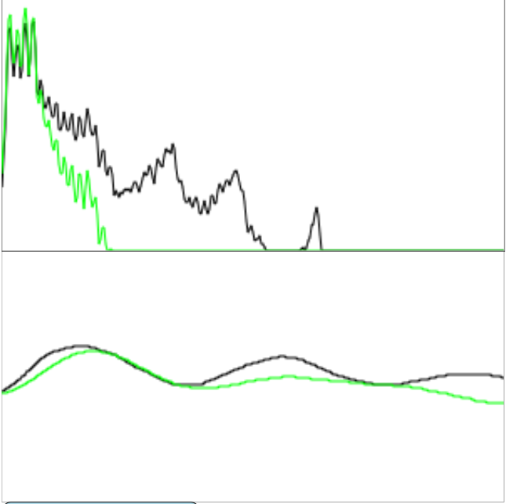

# Sound site

Read: Sound Sight, sound sight aims to offer users an easy way to experience sound in a visual way. It allows users to create their own sounds with their microphone and various audio effects, visualizing the FFT and waveform of both the input and output waves so that users can see what their sounds look like and what the various effects do.